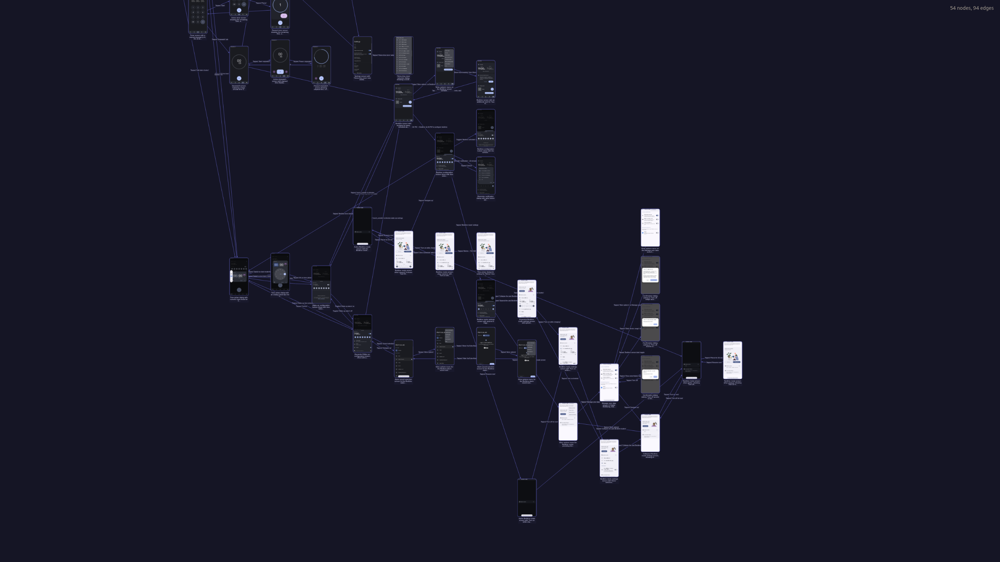

## Autonomous Mobile App Exploration

Give an LLM an Android app. It explores autonomously via Appium and builds a graph of every screen and transition it finds.

Test app: Google Clock (pre-installed, no auth). Surprisingly complex for a full crawl (100+ views).

### Mini crawl demo

Scoped to one tab (others disabled). Gemini 3.0 flash high reasoning (mid-range model), $0.60, 5 minutes. Builds a perfect graph.


*[Video: real-time recording](https://youtu.be/KgohvA_Lyvg)*

*[Interactive graph: explore the graph yourself](https://imonous.github.io/autonomous-mobile-app-exploration-poc/src/visualizer.html?run=mini-crawl)*

### Full crawl demo

All tabs, same model. Works well for ~50 steps, then degrades significantly (solvable past PoC, we're confident the architecture scales).



*[Interactive graph: explore the graph yourself](https://imonous.github.io/autonomous-mobile-app-exploration-poc/src/visualizer.html?run=full-crawl)*

### How it works

Key idea: the graph serves as both memory for the LLM and the output that it builds in real-time.

However, a naive solution still resulted in failure to even crawl a single tab. Things that unlocked it:
- A checklist: the LLM keeps a list of things it's done and still has to do
- Variably compressed history: older history gets truncated more aggressively

---

### Setup

Node >=22, pnpm, Android emulator or device.

```bash
pnpm i  # approve build scripts when prompted
pnpm exec appium driver install uiautomator2
```

`.env`:
```
GOOGLE_GENERATIVE_AI_API_KEY=...
```

Before starting: open Google Clock, navigate to the "Clock" tab, and pin the app. To try a different app and change crawler settings, modify `src/index.ts`.

```bash
# terminal 1
pnpm exec appium --relaxed-security

# terminal 2 (optional): live visualizer
npx serve . # open http://localhost:3000/src/visualizer?live

# terminal 3
pnpm start
```


